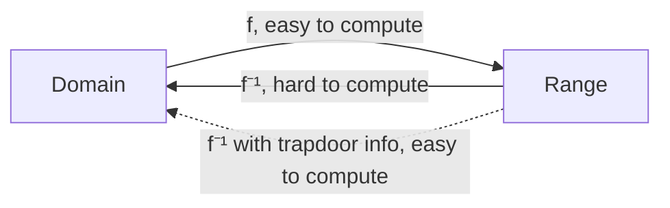

# An Introduction to Mathematical Cryptography (Hoffstein, Pipher, Silverman) - Chapter 2 Notes

## The birth of public key cryptography

The important concept that appeared here is: **trapdoor functions**.

A one way function is an invertible function that is easy to compute, but whose inverse is difficult to compute. 

> The key for a public key consists of $(k_{pub}, k_{priv})$. $k_{priv}$ would be the trapdoor information for $e_{k{pub}}$, beacuse without it, its very hard to compute the inverse.

## The discrete algorithm problem

Let $g$ be a primitive root for $F_{p}$ and let $n$ be a nonzero element for $F_{p}$. The discrete logarithm problem is the problem of finding an exponent $x$ such that $$g^x \equiv h \pmod{p}$$

That number $x$ is called the discrete logarithm of $h$ to the base $g$ and is denoted by $\log_g(h)$.

> **Something beautiful:** if there is one solution, then there are infinitely many, because Fermat little theorem tells us that $g^{p-1} \equiv 1 \pmod{p}$. Hence, if $x$ is a solution to $g^x=h \rightarrow x + k(p+1)$ is also a solution for every valye of $k$ because: $g^{x+k\times(p+1)} = g^x \times (g^{p-1})^k \equiv h \pmod{p}$. So, $log_g:F_p^*\rightarrow \frac{\Z}{(p-1)\times \Z}$. Note that the discrete logarithm is a group isomorphism from $F_p^*\rightarrow \frac{\Z}{(p-1)\times \Z}$.

**Definition**. Let $G$ be a group whose group law we denote by the symbol $\star$. The discrete logarithm problem for $G$ is to determine for any two given elements $g$ and $h$ in $G$, an integer $x$ satisfying $$g \star g \star ... \star g = h$$.

## Diffie-Hellman Key Exchange

Alice and Bob want to share a secret key for use in a symmetric cipher, but they only means of communication is insecure.

#### Private Computations

| **Alice**                   | **Bob**                     |
| --------------------------- | --------------------------- |
| Choose a secret integer `a` | Choose a secret integer `b` |
| Compute $A ≡ g^a (\mod p)$   | Compute $B ≡ g^b (\mod p)$   |

#### Public Exchange of Values

| **Alice → Bob** | **Bob → Alice** |
| --------------- | --------------- |
| Sends `A`       | Sends `B`       |

#### Further Private Computation

| **Alice**                                | **Bob**                                  |
| ---------------------------------------- | ---------------------------------------- |
| Compute $B^a ≡ (g^b)^a ≡ g^{ab} (\mod p)$ | Compute $A^b ≡ (g^a)^b ≡ g^{ab} (\mod p)$|

> **Shared Secret:** $g^{ab} (\mod p)$

**Definition.** Let $p$ be a prime number and $g$ an integer. The Diffie-Helmann Problem is teh problem of computing the value of $g^{ab} (\mod p)$ from the known value of  $g^{a} (\mod p)$ and  $g^{b} (\mod p)$.